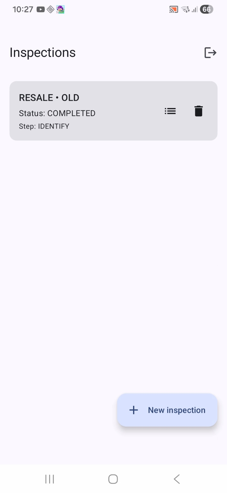
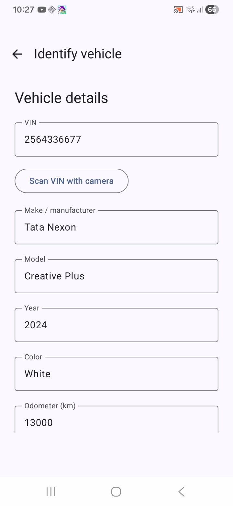
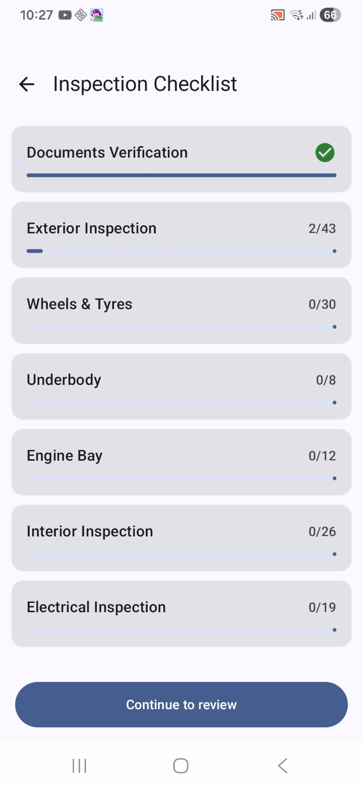
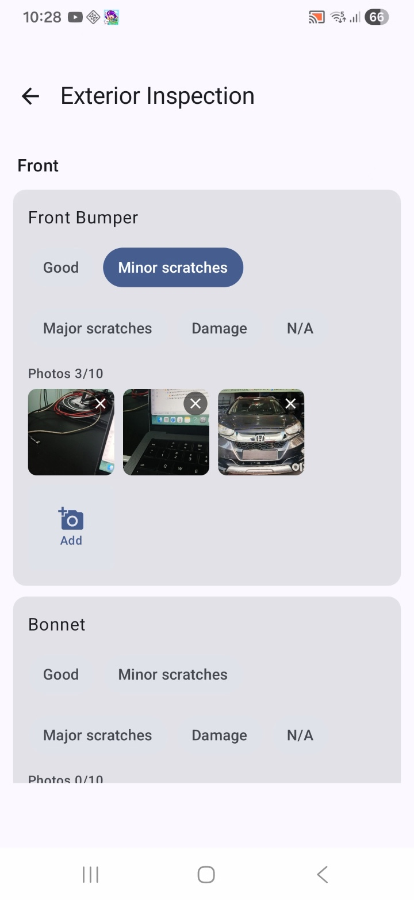
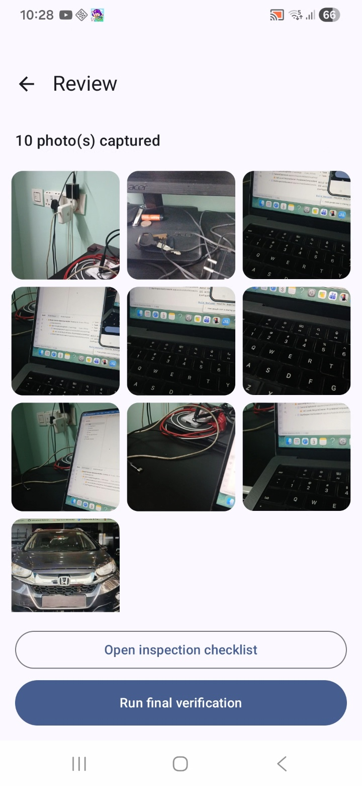
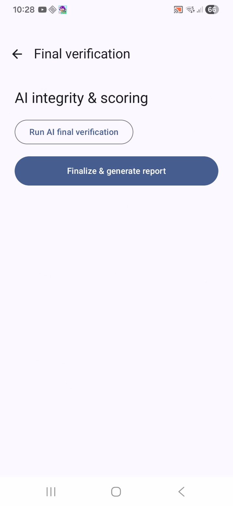
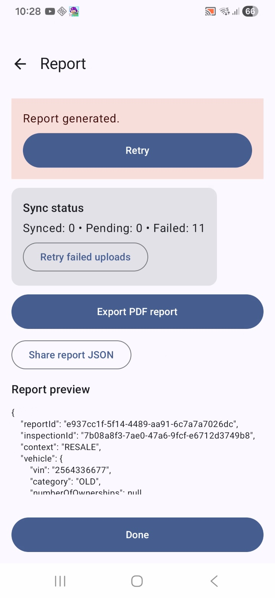
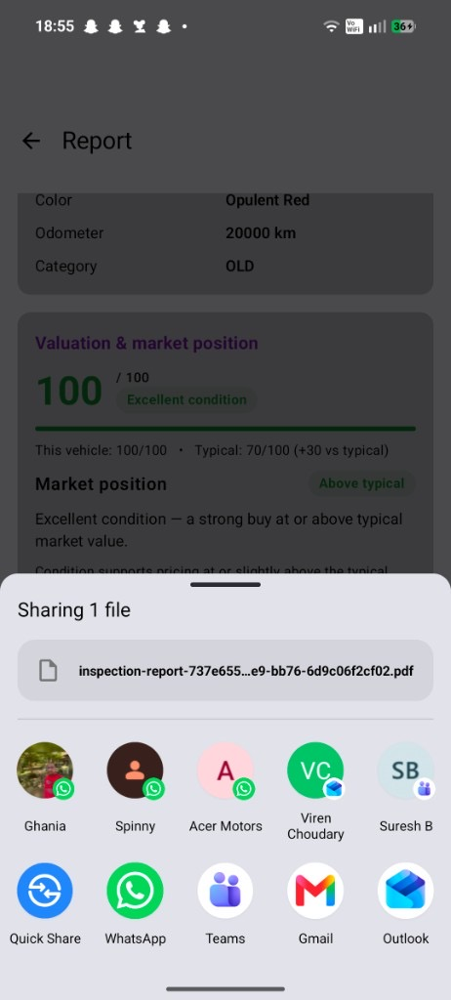

# Vehicle Inspection

An offline-first Android application that guides inspectors through a structured vehicle
inspection, captures per-item photos with AI-assisted and manual damage marking, and produces a
branded, decision-ready report (JSON + PDF).

Built with Kotlin, Jetpack Compose, and Clean Architecture. Works fully offline; cloud
configuration/accounts (Firebase Realtime Database) and AI vision (Gemini) are optional and
degrade gracefully when unconfigured.

---
## Support

> If this project helped you, consider sponsoring or buying me a coffee.
> Your support keeps it maintained, documented, and free.

[](https://github.com/sponsors/NiladriPadhy)
[](https://buymeacoffee.com/npadhy)

This work stays open source. A small contribution helps cover time for bug fixes, new features, and docs.

## Features

- **Checklist-first workflow** — a configurable inspection checklist is the primary interface
  after vehicle identification. Sections/items are filtered by **New vs Old** vehicle
  applicability.
- **Firebase-driven questionnaire** — the inspection checklist and vehicle catalog are loaded from
  Firebase Realtime Database (RTDB) per vendor, stored as a browsable/editable tree. A baseline
  questionnaire ships as a bundled asset so first-time/offline vendors work with no backend. The
  checklist UI **and** the PDF/JSON report both render from this configuration.
- **Questionnaire versioning & snapshotting** — each inspection pins a full snapshot (version +
  hash + definition) of the questionnaire it was created with, so later admin edits in Firebase
  never mutate existing inspections. Config only re-syncs on login/re-login (or when there is no
  local data).
- **Custom accounts + persistent login** — a custom account model (email + on-device PBKDF2 hash)
  backed by RTDB with a local, offline-capable credential cache. Once signed in, the session
  persists across app restarts and the login screen is skipped until you sign out.
- **VIN + classification** — manual VIN entry or on-device OCR (ML Kit), decode/attribute review,
  and New/Old classification (registration required for Old).
- **Per-item photo capture** — each photo-capable checklist item has its own image grid; the photo
  limit is configurable per question in the questionnaire (with a global fallback default of 10).
  Continuous capture with keep/discard confirmation, and per-image delete.
- **Damage marking** — Gemini Vision AI damage detection (green boxes) plus unlimited manual
  annotations (blue pins), with swipe navigation in the image detail view.
- **Granular condition grades** — Good / Minor / Major / Damage / N/A, with context-aware wording.
- **Reports** — an in-app report screen (Inspected Vehicle Details, an "At a glance" rating gauge,
  a **condition & valuation summary**, and a category-wise Inspection summary), plus two exports: a
  **branded, multi-section PDF** (cover, contents, at-a-glance gauge, valuation, category summaries,
  parameter tables, photo gallery, and damage-evidence pages) rendered offline from an HTML/CSS
  template via WebView, and a structured **JSON** report. Reports regenerate on entry, so edits are
  always reflected.
- **Comparison / valuation summary** — an estimated overall condition score and condition band,
  benchmarked against a typical vehicle, to support buy/sell decisions (shown in-app and in the PDF).
- **Vendor branding** — per-vendor company name, tagline, and brand colors are pulled from RTDB
  (`config/branding`) and applied to the report screen and PDF. A bundled `baseline_branding.json`
  asset seeds a first-time vendor's DB and provides the offline/first-run theme; the vendor
  `VENDOR_ID` is used as a fallback **Company Name**.
- **Data export / import** — export all inspections, images, and a CSV plus the pinned
  questionnaire into a single zip for device migration; import validates questionnaire/CSV
  compatibility before restoring.
- **Offline-first + sync** — Room + encrypted file storage is the source of truth; a WorkManager
  sync worker uploads to Firebase when configured and online.

---

## Screenshots

| Dashboard | Identify vehicle | Inspection checklist |
|---|---|---|
|  |  |  |
| Inspections list with resume/delete and start actions | VIN + decoded vehicle details | Catalog-driven sections with completion progress |

| Per-item capture | Review | Final verification |
|---|---|---|
|  |  |  |
| Condition grades + per-item photo grid (max 10) | Captured photos overview | AI integrity & scoring, then finalize |

| Report | Share / export |
|---|---|
|  |  |
| Branded report — inspected vehicle details & at-a-glance gauge | Valuation & market position, then share the branded PDF or JSON |

**Sample output:** [docs/sample-inspection-report.pdf](docs/sample-inspection-report.pdf) — a full
branded PDF generated by the app.

---

## Tech stack

| Area | Choice |
|------|--------|
| Language | Kotlin (JVM target 17) |
| UI | Jetpack Compose, Material 3, Navigation Compose, Coil |
| Architecture | MVVM + Clean Architecture (presentation → domain ← data), Repository pattern |
| DI | Hilt |
| Async | Coroutines + Flow |
| Persistence | Room (source of truth), DataStore (session), encrypted file store |
| Camera / OCR | CameraX, ML Kit Text Recognition |
| AI | Gemini Vision (via a domain port; REST) |
| Backend (optional) | Firebase Realtime Database (per-vendor config + custom accounts) |
| Auth | Custom accounts (on-device PBKDF2) with local credential cache |
| Background work | WorkManager (Hilt integration) |
| Reporting | kotlinx.serialization (JSON), HTML/CSS → PDF via WebView print |
| Migration | Zip-based data export/import (inspections, images, CSV, questionnaire) |

---

## Requirements

- Android Studio (latest stable) or the Gradle CLI
- JDK 17
- Android SDK: `compileSdk 35`, `minSdk 26`
- A device/emulator on API 26+ (camera features require a physical device)

The Gradle wrapper downloads the pinned Gradle version automatically.

---

## Getting started

```bash
git clone <repo-url>
cd Vehicle-Spection-Kotlin

# Build the debug APK
./gradlew :app:assembleDebug

# Install on a connected device/emulator
./gradlew :app:installDebug
```

> If you hit a flaky Gradle configuration-cache error, append `--no-configuration-cache`.

### Login

The app uses a custom account model — create an account from the sign-up screen. Credentials are
hashed on-device (PBKDF2) and stored in Firebase RTDB when configured, with a local credential
cache for offline re-login. When no vendor RTDB is configured, accounts are created locally so the
app remains fully usable offline.

After a successful sign-in the session is persisted, so the app opens straight to the dashboard on
subsequent launches and only shows the login screen again after you sign out.

---

## Configuration

All configuration is optional — the app runs offline without any of it.

### Gemini Vision API key (enables AI damage detection)

Set in `local.properties` (never commit it) or as an environment variable:

```properties
# local.properties
GEMINI_API_KEY=your_key_here
```

Empty key → AI is disabled and the app degrades gracefully (`AiUnavailable`). Model defaults to
`gemini-2.5-flash`.

### Firebase Realtime Database (per-vendor config + accounts)

Configuration and custom accounts live in Firebase RTDB, configured **per vendor at build time**
via `local.properties` (or environment variables). Until `FIREBASE_APP_ID` and `FIREBASE_API_KEY`
are filled in, the app runs in **offline baseline mode** (bundled questionnaire, bundled baseline
branding, local-only accounts) — everything still works, just without RTDB sync.

On first login against a fresh vendor DB, the app seeds `config/branding` from the bundled
`app/src/main/assets/baseline_branding.json`, so the console starts pre-populated. Edit
`config/branding` (`companyName`, `tagline`, `primaryColor`, `secondaryColor`, `accentColor`) in
RTDB to override branding — changes are picked up live on the next report/PDF (no re-login needed).

```properties
# local.properties (never commit real secrets)
FIREBASE_DB_URL=https://<your-db-instance>.firebaseio.com/
FIREBASE_PROJECT_ID=<your-project-id>
FIREBASE_APP_ID=<from Firebase console → Project settings → your app>
FIREBASE_API_KEY=<from Firebase console → Project settings → your app>
VENDOR_ID=<vendor name, shown as "Company Name" on the report>
```

| Key | Purpose |
|-----|---------|
| `FIREBASE_DB_URL` | RTDB instance URL (may be a named instance within a project) |
| `FIREBASE_PROJECT_ID` | Firebase project id |
| `FIREBASE_APP_ID` | Firebase Android app id |
| `FIREBASE_API_KEY` | Firebase API key |
| `VENDOR_ID` | Vendor identity; used as the fallback **Company Name** on reports when `config/branding/companyName` is unset (`default` = hidden) |

### Tunable build values

Override in `local.properties` or via environment variables:

| Key | Default | Purpose |
|-----|---------|---------|
| `MAX_IMAGES_PER_ITEM` | `10` | Global fallback max photos per checklist item (a question may set its own cap in the questionnaire) |
| `PDF_IMAGE_QUALITY` | `70` | JPEG quality (1–100) for photos embedded in the PDF |
| `PDF_GALLERY_IMAGE_WIDTH` | `640` | Embedded pixel width for gallery thumbnails |
| `PDF_DAMAGE_IMAGE_WIDTH` | `1280` | Embedded pixel width for damage-evidence photos |
| `PDF_MAX_IMAGES` | `120` | Hard cap on photos embedded per report (0 = unlimited) |

---

## Testing

```bash
# JVM unit tests
./gradlew :core:domain:test :core:data:testDebugUnitTest :app:testDebugUnitTest

# Compile instrumented tests
./gradlew :app:compileDebugAndroidTestKotlin
```

---

## Project structure

```
app/                         Single-activity Compose host + all feature presentation
  └─ feature/{auth,dashboard,data,start,identify,olddocs,capture,
             imagedetail,checklist,review,verification,report}
  └─ navigation/             VspNavHost (session-aware start destination) + type-safe routes
core/
  ├─ model/                  Domain models, enums, ChecklistCatalog, QuestionnaireConfig/Catalog, AppResult/AppError
  ├─ common/                 Dispatchers, DI plumbing
  ├─ domain/                 Repository interfaces, ports, use cases
  ├─ data/                   Room, repositories, AI/VIN/sync, config/accounts, export/import, report builders
  │    ├─ remote/rtdb/       Firebase RTDB config + custom account sources, FirebaseInitializer
  │    └─ report/            ReportBuilder (JSON), HtmlReportGenerator + WebViewPdfPrinter (PDF)
  ├─ datastore/              Session store (persistent login)
  ├─ ui/                     Material 3 theme + reusable accessible components
  └─ testing/                Test utilities and fakes
firebase/                    Security rules
specs/                       Product spec, plan, tasks, data model, contracts
```

> **Note:** Feature presentation lives inside `:app` (not separate `:feature:*` modules) and
> camera/AI/sync/report logic lives in `:core:data`. This intentionally keeps the build simple
> while preserving Clean-Architecture layering via Hilt. See
> `specs/001-vehicle-inspection-app/tasks.md`.

---

## How the PDF report is generated

The report is produced offline as a **designed HTML/CSS template with inspection data merged in**,
then rendered to a paginated A4 PDF by an off-screen `WebView` print adapter — no system dialog,
no network. Photos are embedded as base64 JPEGs bounded by the `PDF_*` size controls above.
Marked photos appear in the damage-evidence pages; the rest populate the gallery. See
`core/data/.../report/HtmlReportGenerator.kt` and `WebViewPdfPrinter.kt`. A generated example is
at [docs/sample-inspection-report.pdf](docs/sample-inspection-report.pdf).

---

## Documentation

Detailed specifications live under `specs/`:

**`specs/001-vehicle-inspection-app/`** — core inspection app:

- `spec.md` — product specification and functional requirements
- `plan.md` — technical implementation plan
- `tasks.md` — task breakdown and implementation status
- `data-model.md` — entities, Room schema, migrations
- `checklist-integration-plan.md` — checklist-first workflow design
- `contracts/` — repository and integration contracts

**`specs/002-rtdb-config-export-import/`** — RTDB-driven configuration, custom accounts,
questionnaire versioning/snapshotting, and zip-based data export/import:

- `plan.md` — technical implementation plan for the config/accounts/export-import overhaul

---

